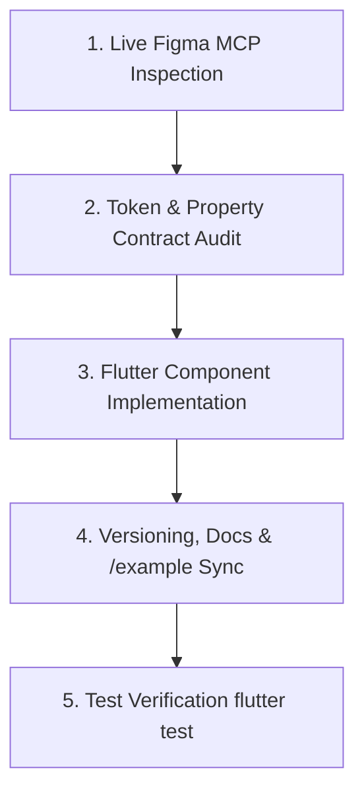

# Figma-Driven Development (FDD) for Flutter Design Systems

This skill guides the end-to-end process of translating Figma components, variants, and design tokens into production-grade Flutter widgets with 1:1 fidelity, runtime interactive state handling, strict versioning, and living catalog synchronization.

---

## 1. Core Principles

1. **Zero Hallucination / Live Inspection Only**: Never guess properties, paddings, colors, borders, or variant names. Inspect the live Figma node payload via Figma MCP (`get_figma_data`).
2. **3-Tier Token Architecture**:
   - **Primitives**: `AlterColors` (raw color hex swatches, e.g. `colorsGray800`, `neutral050`).
   - **Semantic Tokens**: `AlterSemanticTokens` (functional roles, e.g. `interactivePrimary`, `baseBorder`, `textInteractiveHover`).
   - **Component Bindings**: Flutter widgets bind to semantic tokens, resolving dynamically.
3. **Static Contract + Dynamic Layer**:
   - Figma defines the visual contract across static variant combinations (type, size, state frames).
   - Flutter widgets implement the dynamic runtime layer (`MouseRegion`, `AnimatedContainer`, `isSelected`, `isHovered`, micro-animations, flexible slot huggers).
4. **Synchronized Living Showcase**: Every version bump must update the `/example` interactive Widgetbook catalog with updated knobs and state matrices.

---

## 2. The 5-Step FDD Workflow Loop



---

### Step 1: Live Figma MCP Inspection
1. Query the node using `get_figma_data` with the file key and target `nodeId`.
2. Extract the right-panel properties:
   - `componentPropertyDefinitions` (variants, booleans, instance swaps, text slots).
   - Variant axes (e.g. `Type`, `buttonSize`, `State`, `HasIcon`).
   - AutoLayout rules (padding, item spacing, horizontal/vertical sizing, alignment).
   - Border strokes, corner radiuses, and surface fills.
3. Inspect state-specific variant frames (`Default`, `Hover`, `Pressed`, `Selected`, `Disabled`).

---

### Step 2: Token & Property Delta Audit
Before writing code, produce a structured delta report comparing the Figma node against the existing Flutter widget:
- **Variant Axes**: What properties are new, renamed, or updated?
- **Geometry & Spacing**: Exact horizontal/vertical padding and icon gaps per size.
- **Color/Fill Transitions**: Exact semantic tokens bound to each state transition (Default $\rightarrow$ Hover $\rightarrow$ Selected $\rightarrow$ Disabled).
- **Missing Tokens**: If Figma references a token/variable not yet in `tokens.dart` or `swatches.dart`, request user approval to add it before proceeding.

---

### Step 3: Flutter Component Implementation
1. **Component Signature**:
   - Add strong enum/boolean parameters for all Figma variant axes (e.g. `ButtonTextType`, `ButtonTextSize`, `isSelected`, `isHovered`).
   - Provide standard default values matching Figma defaults.
2. **Interactive States**:
   - Wrap interactive surfaces in `MouseRegion(onEnter: ..., onExit: ...)` with `cursor: SystemMouseCursors.click` to guarantee responsive pointer tracking across Web and Desktop.
   - Support both automatic hover tracking (`_internalHovered`) and explicit overrides (`bool? isHovered`).
   - Evaluate active hover with the resilient pattern: `(widget.isHovered == true) || _internalHovered` so untoggled knobs (`false`) in showcase tools never silence real mouse cursor events.
   - Use `AnimatedContainer` or micro-animations with standard curves (e.g. `Curves.easeOut`, `150ms`).
3. **Slots & Composition**:
   - Accept generic `Widget?` slots for icons or prefixes/suffixes.
   - Hug dynamic content gracefully when slots are `null` without leaving dangling margins.
4. **Nested Components**:
   - If a child node is a distinct Figma component, check if it already exists in the design system.
   - Reuse existing subcomponents rather than reimplementing ad-hoc inline layouts.

---

### Step 4: Versioning, Docs & Living Showcase Sync
1. **Version Constant**:
   - Increment `static const String version = 'vX.Y.Z';` in the component file.
   - Add an inline comment detailing the change.
2. **Component Markdown Documentation**:
   - Update `lib/components/<category>/<component>.md`.
   - Record changes in reverse-chronological changelog order.
3. **Interactive Widgetbook Showcase (`/example`)**:
   - Update `example/lib/categories/<category>_category.dart`.
   - Add Knobs for newly introduced properties, sizes, and state overrides.
   - Update the matrix preview to display all variants across all states.

---

### Step 5: Test & Build Verification
1. **Automated Widget Tests**:
   - Update `test/alter_test.dart` to verify all new properties, render branches, size paddings, and selection/hover states.
   - Run `flutter test` and ensure all tests pass (0 failures).
2. **Living Example Check**:
   - Ensure `example/test/widget_test.dart` passes.
   - Verify that the running Flutter example app hot-reloads cleanly without layout overflows.

---

## 3. Node Delta Report Template

When reporting node inspection results to the user, use this format:

```markdown
### 🔍 Figma Node Inspection: [ComponentName] (`NodeId`)

#### 1. Variant Properties & Axes
- **Property Name**: `[options]` (Default: `[default]`)

#### 2. Geometry & AutoLayout
- **Normal Size**: Padding `[H x V]`, Spacing `[gap]`, Radius `[R]`
- **Large Size**: Padding `[H x V]`, Spacing `[gap]`, Radius `[R]`

#### 3. Token & State Matrix
| Variant Type | State | Surface Fill | Stroke / Border | Text / Icon Foreground |
| :--- | :--- | :--- | :--- | :--- |
| **Primary** | Default | `tokens.xxx` | `tokens.yyy` | `tokens.zzz` |
| **Primary** | Hover | `tokens.xxx` | `tokens.yyy` | `tokens.zzz` |
| **Primary** | Selected | `tokens.xxx` | `tokens.yyy` | `tokens.zzz` |

#### 4. Proposed Implementation Changes
1. Update `version` to `vX.Y.Z`.
2. Add parameter `...`
3. Update `/example` showcase with new knobs and matrix.
```
